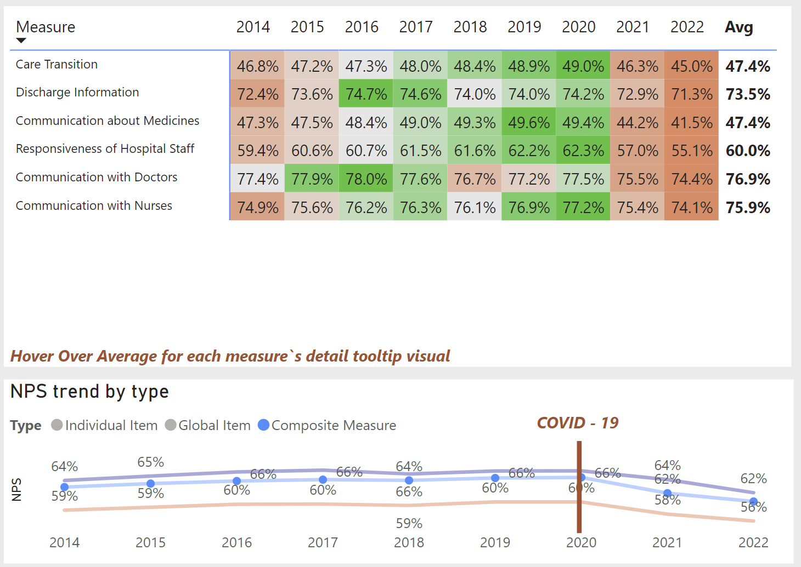
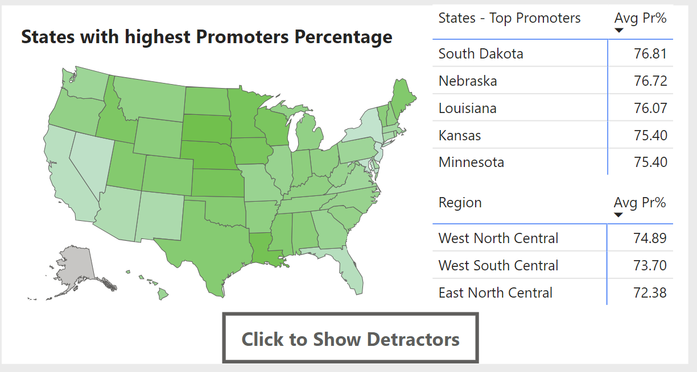
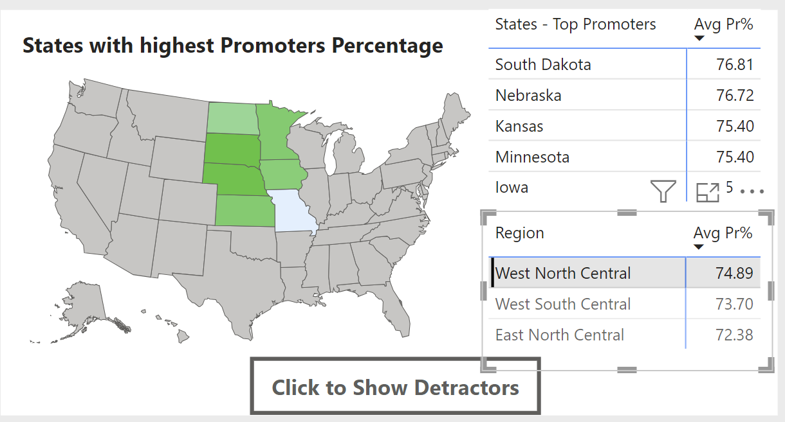
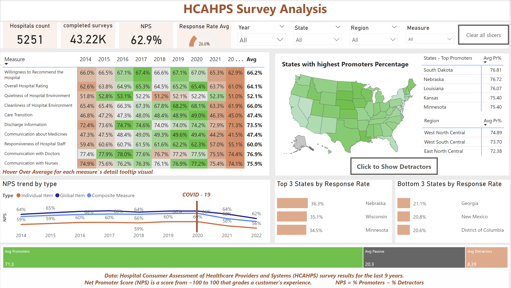
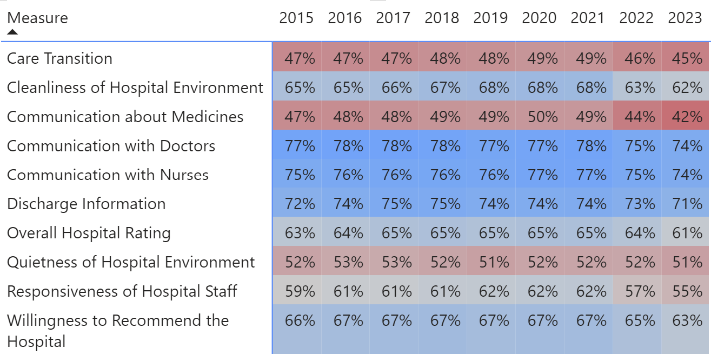
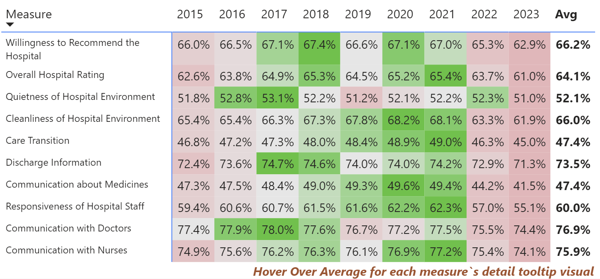

# Healthcare-HCAHPS-Survey-Analysis - American Hospital Association

[Interactive Dashboard](https://app.powerbi.com/view?r=eyJrIjoiZTVmYjkxYzMtZDEwZC00MGE3LWJhMjctOTYwMTViZjQyYWQwIiwidCI6ImM2ZTU0OWIzLTVmNDUtNDAzMi1hYWU5LWQ0MjQ0ZGM1YjJjNCJ9)

### Introduction

The Hospital Consumer Assessment of Healthcare Providers and Systems **(HCAHPS) survey is a standardized tool used to measure patients` perceptions of their hospital experiences** in the United States.
- It was developed by the Centres for Medicare & Medicaid Services (CMS) in collaboration with the Agency for Healthcare Research & Quality (AHRQ).
- **The primary goal of the HCAHPS survey is to collect feedback from patients about their care experiences, to improve the quality of healthcare services provided by hospitals**.

### Role 
Participants were tasked to play the role of a Data Analyst for the American Hospital Association (AHA), a national organization that represents hospitals and their patients and acts as a source of information on healthcare issues and trends.

### Objective

To analyze the HCAHPS survey results for the past 9 years and evaluate whether it has been successful in creating incentives for hospitals to improve their quality of care.

### About The Data Set
- All of the data used in this challenge were provided by Maven Analytics.
- It comprised 7 CSV tables, namely: measures, national_results, questions, reports, responses, state_results, and states.
- A separate CSV table was also provided which serves as a dictionary for the description of each column in each of the 7 CSV tables.
- The survey data spans from 2013 to 2022.
- The survey collects all the measures in 3 categories. Top box percentage (Promoters), Middle Box percentage (passives), and bottom Box percentage (Detractors).
  
### KPI - Net Promoter Score (NPS) 
To analyze the healthcare survey dataset, I`m going to use a Key Metric called NPS.
- It is a widely used metric to measure customer satisfaction and loyalty. 
- It is derived from responses to a simple survey question, On a scale of 0 to 10. - Based on their responses, respondents are categorized into three groups:
  - Promoters (score 9-10): These are enthusiastic customers who are likely to recommend your product or service.
  - Passives (score 7-8): These customers are satisfied but not enthusiastic. They are unlikely to actively promote your product but are also unlikely to speak negatively about it.
  - Detractors (score 0-6): These customers are unhappy and may actively discourage others from using your product or service.

The NPS is then calculated by subtracting the percentage of Detractors from the percentage of Promoters. 
- The formula is as follows:
> NPS=%Promoters−%Detractors
- NPS can range from -100 to +100, with positive scores indicating a higher likelihood of customer recommendation and negative scores suggesting room for improvement.
- NPS is a relative metric, and the score alone might not provide a comprehensive understanding of customer satisfaction.
- It is often more valuable when tracked over time or compared to industry benchmarks.

## Analysis

The primary concept of the report is to showcase the trends and impacts of the HCAHPS survey over the years.

I chose to focus solely on the NPS score. My goal was to determine if patient satisfaction and loyalty increased or decreased over the past 9 years. 

### Overview
- Total hospital count - 5251
- Total number of completed surveys - 43.2 K
- Average Response rate - 26.6%
- NPS 62.9%

  
**Insights:**

Efforts should be made to enhance the overall response rate as analyzing with a low response rate may lead to skewed results.

### Heat map visual with tooltip

The heat map visual shows the distribution of NPS for each measure over the years with a tooltip to easily visualize this trend.

**Insights:**

- It is evident from the heat map that the NPS score of most of our measures has seen an increasing trend from 2014 to 2020.
- We can see a clear change in shift by the year 2020 which could be attributed to COVID-19 and hence a shift in patients' sentiments.
- But the measures - "Quietness of the hospital" and "Communication with the Doctors" show a continued decrease. This could be something to research further.

### NPS trend

The Line chart shows the trend of NPS over the years for each type of measure.

**Insights:**

- The Global items have the highest NPS scores with an average of 65%. The measures under this type are:
  - Willingness to recommend the hospital and
  - Overall hospital ratings
- The Individual Items have the lowest scores.
  - Quitenes of hospital environment with an average of 52% and
  - Cleanliness of the hospital environment with an average of 66%
- Among the Composite measures, the average scores of both of the below are 47%
  - Care Transition
  - Communication about medication
- Discharge info and communication with Doctors and nurses faired the top scores with scores higher than 75%

### Top Promoters/Detractors

- I have used **Bookmark** to study Promoters or Detractors using a **Shape map, top 5 States matrix, and Top Region matrix**. The other visual can be accessed by clicking the show button.
- The color Saturation on the Shape map is indicated by the value of Promoters or Detractors

**Insights:**

- Helps to study the data by state or by region.
- Analyze the region/ state with high detractors and follow up with corrective measures.

### Top/Bottom States by response rate is represented by bar graphs

**Insights:**

- The survey data on the whole has a low response rate with Nebraska (36.3%) being the top state by response rate.

## Final Dashboard

### Challenges Faced

While generating the heat map visual:

- I tried conditional formatting. But it applied formatting to the whole matrix which was not what I was looking for.
  
   
  
- I wanted to create a visualization where the heatmap is separate for each row in the matrix.
- I tried searching the net, YouTube, and ChatGPT. Could not find a possible solution. So I turned to LinkedIn to get help from my connections.
- Here`s [my post](https://www.linkedin.com/posts/mythily-ramanathan_question-for-power-bi-enthusiasts-activity-7136472421443739648-fWlR?utm_source=share&utm_medium=member_desktop)
- I was guided in the right direction, following which I figured out that I had to use the RankX function DAX formula to generate a rank for each column (year) based on the measure.
  

- Used this rank in the conditional formatting to get my result.
  

https://www.youtube.com/watch?v=Mv1arp_Cc9o&t=313s
### Conclusion

 The Maven Analytics healthcare challenge provided a rewarding journey into evaluating the quality of care in hospitals through the lens of HCAHPS survey data spanning nine years. The analysis illuminated crucial aspects, including overall improvements and areas that demand focused attention.

**Recommendations and Key Takeaways**

- **Areas of Excellence**: Noteworthy progress was observed in Discharge Information, while positive responses in Communication with Doctors and Nurses were consistently maintained.
- **Opportunities for Growth**: Care Transition and Communication about medication emerged as the focal points for improvement, emphasizing the need for strategic interventions to elevate patient experiences.
- **Stability Amid Change**: Despite fluctuations, the Quietness of the Hospital Environment displayed resilience with the least percentage decrease, warranting a closer look.
- **Regional Dynamics**: South Dakota and Nebraska showcased the highest positive response rates, suggesting potential best practices worthy of exploration by other regions.
- **Survey Awareness:** Hospitals should intensify efforts to raise awareness about completing surveys before patients' discharge, ensuring a comprehensive representation of experiences.

This project serves as a testament to the power of data analytics in unraveling insights that can steer the healthcare industry toward continuous improvement. 

Your feedback on this journey is highly valued and welcomed! 
